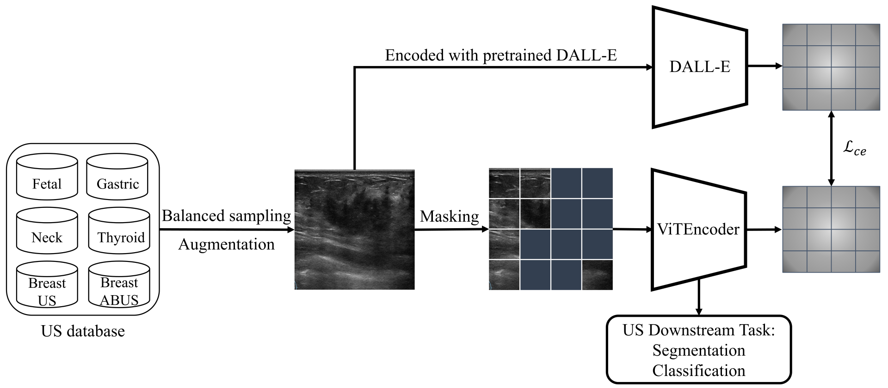

______________________________________________________________________

<div align="center">

# UltraSound Foundation Model (USFM)

<a href="https://pytorch.org/get-started/locally/"></a>
<a href="https://pytorchlightning.ai/"></a>
<a href="https://hydra.cc/"></a>
<a href="https://github.com/ashleve/lightning-hydra-template"></a><br>

</div>

<div align="center">

## ✨✨✨

## Updated on 2023.12.22

## **Our new version of USFM has been released ([weight](<https://dl.orangedox.com/FDUUSFM>)). Implementation code for downstream tasks is coming soon!**

</div>

### The USFM is generalized to **various human organs** with **high label efficiency** for US segmentation, classification and image enhancement tasks by pre-training on the **largest multi-organ, multi-center, multi-device database!**


<hr style=" height:2px;border:none;border-top:2px dotted #185598;" />

<div align="center">

## Old VERSION
</div>
Updated on 2023.06.20

## ✨ Key Features

This repository provides the official implementation of the Ultrasound foundation model (USFM) for ultrasound image downstream tasks.

key feature bulletin points here:

- The model was pre-trained on over 2M ultrasound images from five different tissues.
- We used a pre-training strategy based on masked image modeling (BEiT) with more sensitivity to structure and texture.
- The pre-trained model achieves SOTA performance on multiple ultrasound image downstream tasks. A more extensive test is in progress

## 📌 Links

- [Paper](In progress)
- [Model]([https://](https://drive.google.com/file/d/1_L_z34LOMxwhsqWpZwJ9eOPXvk_Wwd5N/view?usp=sharing))
- [Code]([https://](https://github.com/George-Jiao/USFM))

## 💡 Details

Our ultrasound foundation model (USFM) is pre-trained on the database containing ultrasound images of six different tissues. The most popular encoder, visual transformer (ViT), was chosen as the base architecture. For the pre-training strategy, we refer to BEiT and use the fully trained DALL-E as a strong Teacher to guide our model to learn the proper feature representation. Experimental results demonstrate that our model has excellent performance on ultrasound image downstream tasks.



## 🔥 Installation

### 1. Installing dependencies

- Pip

```bash
# clone project
git clone https://github.com/George-Jiao/USFM
cd USFM

# [OPTIONAL] create conda environment
conda create -n USFM python=3.9
conda activate USFM

# install pytorch according to instructions
# https://pytorch.org/get-started/

# install requirements
pip install -r requirements.txt
```

- Conda

```bash
# clone project
git clone https://github.com/George-Jiao/USFM
cd USFM

# create conda environment and install dependencies
conda env create -f environment.yaml

# activate conda environment
conda activate USFM

pip install -U openmim
mim install mmcv
```

### 2. Installing USFM

#### Install USFM from the source for better development and debugging

```bash
# In the folder USFM
pip install -v -e .
```

## 📦️ Preparing the data

### 1. Dataset introduction

USFM is pre-trained on 3 private and 4 public datasets using BEIT under the manner of feature reconstruction. Several datasets were collected as downstream tasks for validation. Here, we provide 2 public datasets for the ultrasound downstream task.

- tn3k \[link: <https://drive.google.com/file/d/1jPAjMqFXR_lRdZ5D2men9Ix9L65We_aO/view?usp=sharing\>]
- tnscui \[link: <https://drive.google.com/file/d/1Ho-PzLlcceRFdu0Cotxqdt4bXEsiK3qA/view?usp=sharing\>]

### 2. Download and prepare the dataset

```bash
# mkdir data/
```

Download the dataset from Google Drive [tn3k](https://drive.google.com/file/d/1jPAjMqFXR_lRdZ5D2men9Ix9L65We_aO/view?usp=sharing) and [tn3k](tnscui) and save it in folder data.

```bash
# set the Dataset name (one of tn3k, tnscui)
export dataset=tn3k
# unzip dataset
tar -xzf $dataset.tar.gz $dataset/
```

## 🚀 Finetuning USFM on the downstream dataset

### 1. Download the weights of the USFMpretrained

Download the model weight from Google Drive [USFMpretrained](https://drive.google.com/file/d/1_L_z34LOMxwhsqWpZwJ9eOPXvk_Wwd5N/view?usp=sharing) and save it in folder assets as USFMpretrained.ckpt.

### 2. Finetuning USFM for segmentation

```bash
python usfm/train.py tag=seg_$dataset experiment=ftSeg.yaml model.net.backbone.pretrained=assets/USFMpretrained.ckpt data=$dataset data="{batch_size:40, num_workers:4}" trainer="{devices:[0,1], strategy:ddp}"
```

## 📝 Fine-tuning Results

## 🙋‍♀️ Feedback and Contact

- Email
- Webpage
- Social media

## 🛡️ License

This project is under the CC-BY-NC 4.0 license. See [LICENSE](LICENSE) for details.

## 🙏 Acknowledgement

Our code is based on [BEiT](https://github.com/microsoft/unilm), [transformer](https://github.com/huggingface/transformers), [pytorch-image-models
](https://github.com/huggingface/pytorch-image-models), and [lightning-hydra-template
](https://github.com/ashleve/lightning-hydra-template). Thanks them for releasing their codes.

## 💚 Contribution

Have a question? Found a bug? Missing a specific feature? Feel free to file a new issue, discussion or PR with respective title and description.

Please perform a code check before committing with the pre-commit hooks.

```bash
# pip install pre-commit
pre-commit run -a
```

Update pre-commit hook versions in `.pre-commit-config.yaml` with:

```bash
pre-commit autoupdate
```
